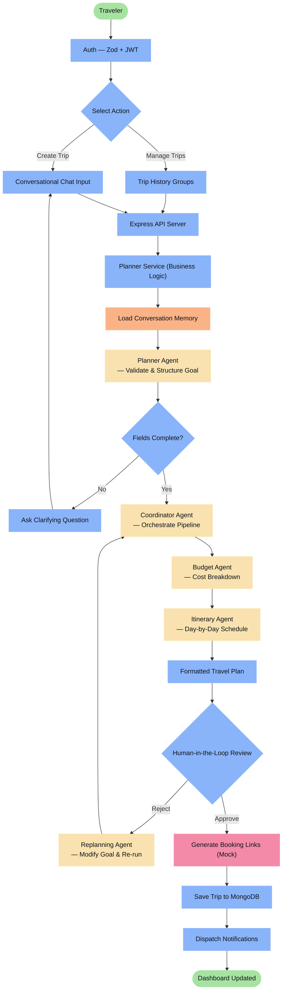
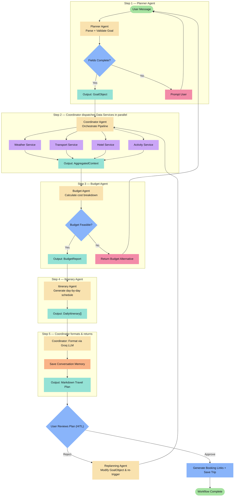
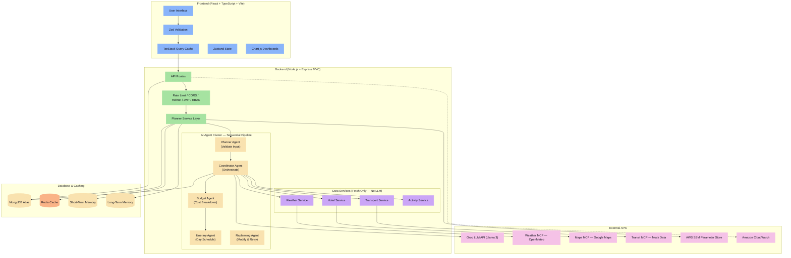
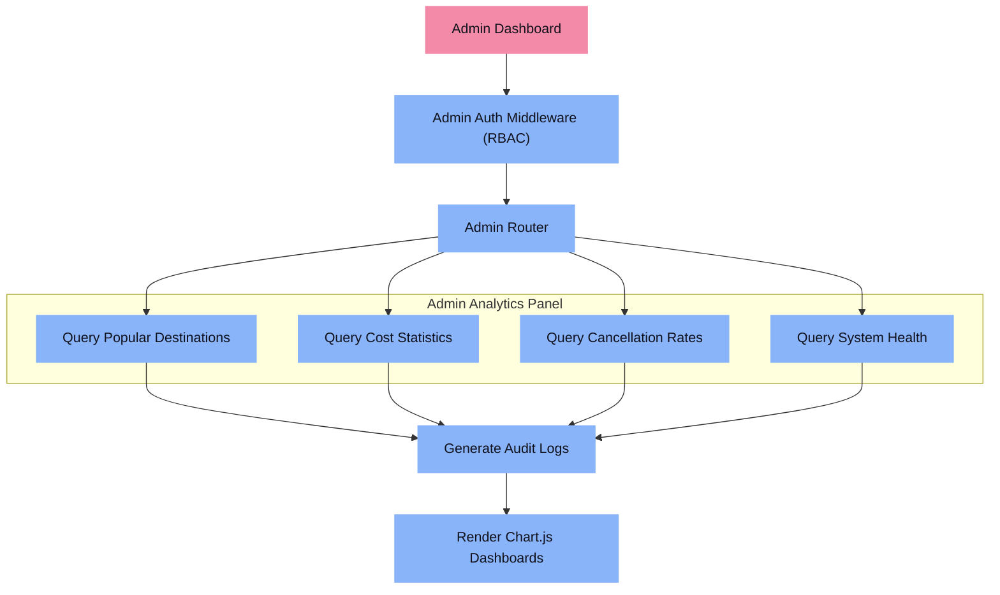

# Travel Planner AI Agent — Capstone Project Documentation

> A multi-agent travel planning system built as a Presidio internship capstone. Each AI agent has a single, clearly defined responsibility. The Coordinator Agent calls all other agents in sequence and combines their outputs into a final travel plan.

---

## MAP: Applied Curriculum Topics

| Week | Focus Area | Applied Concepts |
|:-----|:-----------|:-----------------|
| **Week 1** | Foundations & DSA | MongoDB index design (`userId`, `tripId`, `status`), schema validations, Git branching strategy |
| **Week 2** | Backend | Express.js MVC with Planner Service layer, global rate-limiting, Morgan logging, JWT + RBAC auth |
| **Week 3** | Frontend | React SPA (Vite), Zustand state, React Hook Form + Zod validation, TanStack Query caching, Chart.js dashboards |
| **Week 4** | DevOps | GitHub Actions CI/CD, Docker containerisation, Terraform IaC on AWS (EC2 / S3 / CloudFront / SSM) |
| **Week 5** | Agentic AI | 3-agent LangChain pipeline orchestrated by Coordinator Agent, 4 fetch-only data services, MCP tool calling, Redis caching, human-in-the-loop validation |

---

## Agent Design — Single Responsibility Principle

> [!IMPORTANT]
> Every agent in this system has **exactly one job**. The **Coordinator Agent** is the only agent that knows about the others — it calls them in sequence and merges their outputs into the final plan. No other agent talks to another agent directly.

---

### Agent 1 — Planner Agent

**Single Responsibility:** Parse and validate the user's natural-language travel request.

| What it receives | What it returns |
|:----------------|:----------------|
| Raw user message + conversation history | A structured goal object `{ destination, dates, budget, travelers, preferences }` |

**It does only this:**
- Reads the user's message and conversation memory.
- Identifies whether required fields (destination, dates, budget, traveler count) are present.
- If fields are missing → prompts the user for clarification and waits.
- If all fields are present → returns a clean, validated `GoalObject` to the Coordinator.

> It does **not** fetch any data. It does **not** build a schedule. It only validates and structures input.

---

### Agent 2 — Budget Agent

**Single Responsibility:** Estimate costs and produce a budget breakdown.

| What it receives | What it returns |
|:----------------|:----------------|
| `GoalObject` + raw data (transport costs, hotel rates, activity prices) from Data Services | A structured `BudgetReport` with per-category estimates and a 10% emergency buffer |

**It does only this:**
- Takes the aggregated data from the Coordinator.
- Calculates transport, hotel, food, activity, and local transport costs.
- Adds a 10% emergency buffer.
- If total cost exceeds the user's budget → returns a fallback alternative (e.g., fewer days, budget hotels).
- Returns a `BudgetReport` object to the Coordinator.

> It does **not** build any schedule. It does **not** call any external API. It only calculates money.

---

### Agent 3 — Itinerary Agent

**Single Responsibility:** Generate a day-by-day travel schedule.

| What it receives | What it returns |
|:----------------|:----------------|
| `GoalObject` + `BudgetReport` + raw service data (weather, transport slots, hotel, activities) | A `DailyItinerary[]` — one structured object per day, with timeslots, venues, and costs |

**It does only this:**
- Takes the approved budget caps from the Budget Agent.
- Slots activities, meals, transport legs, and rest time into a time-ordered daily schedule.
- Respects weather data (e.g., swap outdoor activities on rainy days).
- Returns a complete `DailyItinerary` array to the Coordinator.

> It does **not** calculate costs. It does **not** fetch data. It only arranges time.

---

### Coordinator Agent — Orchestrator

**Single Responsibility:** Call all agents in the correct sequence, combine their outputs, and return the final itinerary to the user.

**Sequential call chain:**

```
1. Receive GoalObject from Planner Agent
        ↓
2. Dispatch Data Services in parallel
   ├── Weather Service   → WeatherData
   ├── Transport Service → TransportData
   ├── Hotel Service     → HotelData
   └── Activity Service  → ActivityData
        ↓
3. Merge all service outputs → AggregatedContext
        ↓
4. Call Budget Agent (AggregatedContext) → BudgetReport
        ↓
5. Call Itinerary Agent (AggregatedContext + BudgetReport) → DailyItinerary[]
        ↓
6. Format final plan via Groq LLM → Markdown Travel Plan
        ↓
7. Return Markdown Travel Plan to user for HITL review
```

> It does **not** do any planning, budgeting, or scheduling itself. It only calls other agents in order and passes outputs between them.

---

### Replanning Agent

**Single Responsibility:** Re-run the pipeline when the user rejects a plan.

| What it receives | What it returns |
|:----------------|:----------------|
| Rejection feedback + original `GoalObject` | A modified `GoalObject` with updated constraints |

**It does only this:**
- Reads the user's rejection reason (e.g., "too expensive", "change hotel", "add one more day").
- Applies the requested modification to the original `GoalObject`.
- Passes the updated goal back to the Coordinator to re-run the full sequence.

> It does **not** generate a new plan itself. It only modifies the input and re-triggers the Coordinator.

---

### Data Services — Fetch Only (No LLM)

> [!NOTE]
> These are not agents. They are plain async functions that fetch and return data. They have no reasoning or decision-making capability.

| Service | Fetches from | Returns |
|:--------|:-------------|:--------|
| **Weather Service** | OpenMeteo API via Weather MCP | 5-day forecast for destination |
| **Transport Service** | Mock bus/train schedules via Transit MCP | Available routes, departure times, costs |
| **Hotel Service** | Mock hotel availability via Hotel MCP | Available hotels with ratings and nightly rates |
| **Activity Service** | Static data + Google Maps MCP | List of local attractions, restaurants, and events |

---

## Booking — Honest Workflow

> [!WARNING]
> There is **no Booking Agent** in the execution pipeline. After the user approves the plan, the system generates **external booking links** and saves the trip to MongoDB. No real reservations are made, no payments are processed.

```
Coordinator Agent returns Itinerary
          ↓
User Reviews Plan (Human-in-the-Loop)
          ↓ Approve
Generate External Booking Links
(IRCTC / MakeMyTrip / Booking.com deep-links)
          ↓
Save Trip to MongoDB { status: "Confirmed" }
          ↓
Dispatch Notifications (Email / Calendar Sync)
```

---

## 1. User Flow

Traces the traveler's path from login through agent execution to trip save.



---

## 2. Agent Flow — Sequential Execution

Shows exactly how the Coordinator calls each agent in sequence and how outputs are passed between them.



---

## 3. System Architecture

Maps all tier boundaries: Frontend, Backend Service Layer, AI Agent Cluster, Data Services, MCP Integrations, and Storage.



---

## 4. Deployment Pipeline

Illustrates the Git → CI → CD pipeline, from local branch through GitHub Actions to AWS infrastructure.


---

## 5. Admin Workflow

Admin users bypass the AI layer entirely and query MongoDB directly for analytics dashboards.



---

## 6. Functional Execution Scenarios (Simulated Outputs)

### A. Itinerary Agent Output

The Itinerary Agent's sole job is to generate the day-by-day schedule. It consumes the `BudgetReport` (daily spend caps) and raw service data (weather, transport, hotels, activities) returned by the Coordinator.

```markdown
# 5-Day Vacation in Ooty (Traveler Count: 2)
### Status: Draft | Month: October | Weather: Moderate Clear Skies

## Day 1 — Chennai to Ooty Arrival
* **08:00 AM – 11:30 AM | Rail Transit**
  * Train: Chennai Central → Mettupalayam | Cost: ₹1,200 (2 Sleeper Tickets)
* **11:30 AM – 12:00 PM | Hotel Check-in**
  * Hotel: Ooty Vista Inn | Transfer: 20-min cab from Mettupalayam station
* **12:00 PM – 01:30 PM | Lunch**
  * Restaurant: Garden View Cafe | Hours: 11:00 AM–10:00 PM | Cost: ₹600
* **03:00 PM – 05:30 PM | Afternoon Sightseeing**
  * Destination: Government Botanical Garden | Entry: ₹100
  * Weather Note: Clear Skies — open-air activity recommended
* **05:30 PM – 07:30 PM | Evening Activity**
  * Destination: Ooty Tea Factory & Museum | Ticket: ₹50
* **08:00 PM – 09:30 PM | Dinner**
  * Restaurant: Mountain Retreat Dining | Cost: ₹800
* **Day 1 Total**: ₹2,750 (excludes hotel pre-payment)
```

---

### B. Budget Agent Output

The Budget Agent's sole job is cost estimation. It receives raw price data from services and outputs a `BudgetReport` with a 10% emergency buffer. This report is handed to the Itinerary Agent as daily spend caps.

| Expense Category | Item Details | Estimated Cost |
|:---|:---|:---:|
| **Transport** | Rail fares — Chennai to Ooty (return) | ₹1,800 |
| **Hotel** | 4 Nights — Ooty Vista Inn | ₹8,500 |
| **Food / Dining** | Meals, breakfast packages, local dining | ₹4,000 |
| **Activities** | Entry tickets, botanical gardens, tea estate | ₹3,500 |
| **Local Transport** | Station cabs, local auto transfers | ₹2,500 |
| **Emergency Fund** | 10% Reserve Buffer | ₹2,030 |
| **Grand Total** | All categories including emergency fund | **₹22,330** |
| **Remaining Budget** | Against base limit of ₹30,000 | **₹7,670** |

---

## 7. Tech Stack

| Layer | Technology | Purpose | Free Tier |
|:------|:-----------|:--------|:----------|
| **Frontend** | React (TypeScript) | Single Page Application UI | ✅ Free |
| | Vite | Dev server & production bundler | ✅ Free |
| | Tailwind CSS | Utility-first styling | ✅ Free |
| | React Hook Form + Zod | Auth form state & schema validation | ✅ Free |
| | TanStack Query | Query caching, pagination & HTTP state | ✅ Free |
| | Zustand | Client-side state store | ✅ Free |
| | Chart.js | Admin analytics dashboards | ✅ Free |
| | Axios | REST HTTP client | ✅ Free |
| **Backend** | Node.js + Express.js | REST API server (MVC pattern) | ✅ Free |
| | Mongoose | MongoDB ODM & schema enforcement | ✅ Free |
| | JWT | Authentication & RBAC roles | ✅ Free |
| | bcrypt | Password hashing | ✅ Free |
| | express-rate-limit | API rate throttling | ✅ Free |
| | Helmet | Express security headers | ✅ Free |
| | Morgan / Winston | Request tracing & diagnostics | ✅ Free |
| **AI / Agents** | Groq LLM API | LLM inference (Llama 3) | ✅ Free Developer Tier |
| | LangChain JS | Agent orchestration framework | ✅ Free |
| | Model Context Protocol (MCP) | Standardised tool-calling interface | ✅ Free |
| **Data & Cache** | MongoDB Atlas | Primary database (M0 shared cluster) | ✅ Free (M0 Cluster) |
| | Redis | In-memory API caching (weather, schedules) | ✅ Free (Self-hosted on EC2) |
| **DevOps** | GitHub Actions | CI/CD pipeline automation | ✅ 2,000 min/month free |
| | Docker | Container packaging | ✅ Free (Community) |
| | Terraform | Infrastructure as Code (VPC / EC2 / S3) | ✅ Free CLI |
| | AWS EC2 | Backend server host | ✅ 12-Month Free Tier |
| | AWS S3 + CloudFront | Static frontend host & CDN | ✅ 12-Month Free Tier |
| | AWS SSM Parameter Store | Secrets & config management | ✅ Always Free |
| | Amazon CloudWatch | Monitoring, alarms & logs | ✅ Standard Free Tier |
| **External APIs** | OpenMeteo API | Weather forecast data | ✅ Free (Non-Commercial) |
| | Google Maps API | Geocoding & location mapping | ✅ $200 monthly credit |
| | Google Calendar API | Event & reminder sync | ✅ Free Developer API |
| | Mock MCP Tools | Bus, Train, Hotel (mock only) | ✅ Free Mock Interfaces |

---

> **Note on Scope:** This is an internship capstone project. The AI pipeline demonstrates multi-agent orchestration with single-responsibility agents. The booking flow, transport schedules, and hotel data are intentionally mocked to focus on architecture and agent coordination patterns rather than production integrations.
