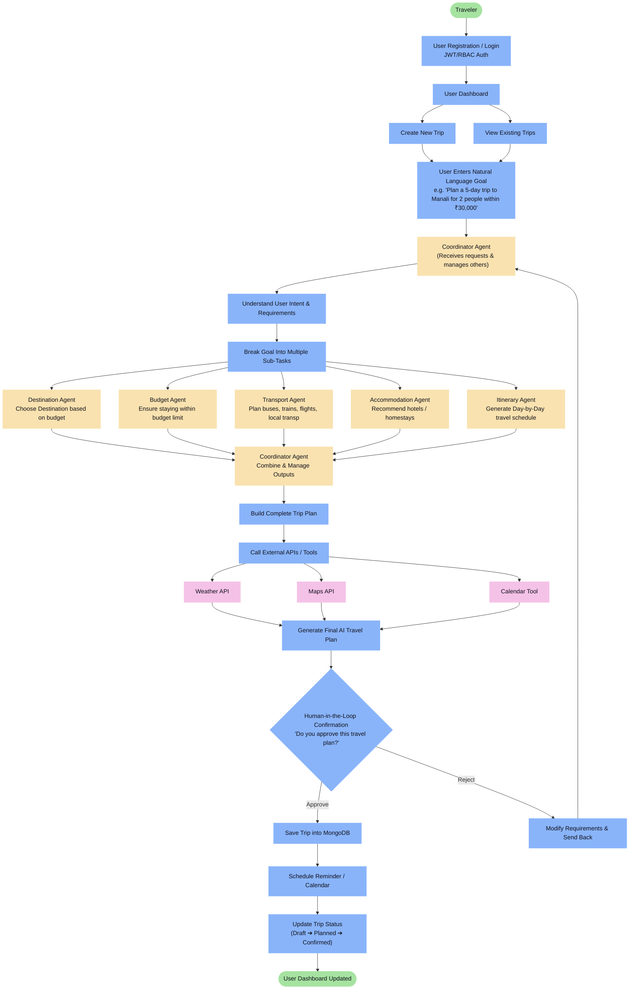
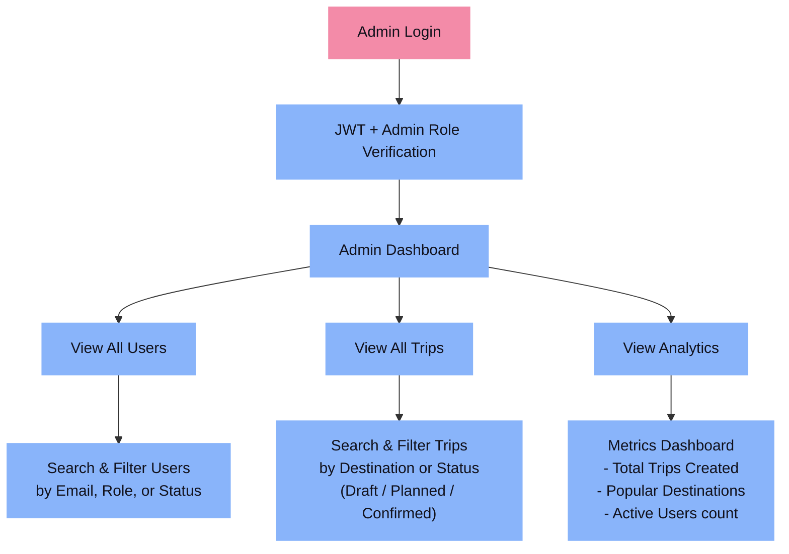
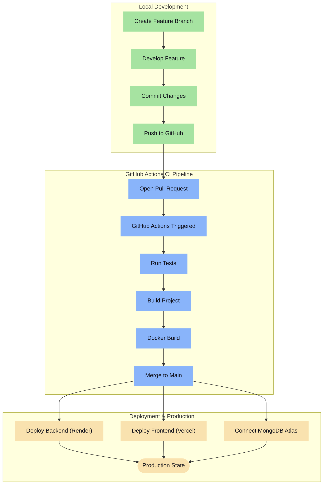
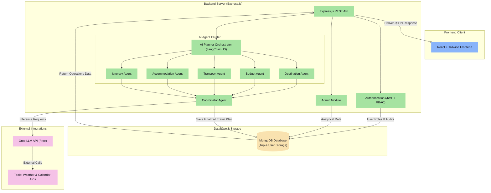

```mermaid
graph TD
    classDef default fill:#1e1e2e,stroke:#cdd6f4,stroke-width:2px,color:#cdd6f4;
    classDef startEnd fill:#a6e3a1,stroke:#a6e3a1,stroke-width:2px,color:#11111b;
    classDef process fill:#89b4fa,stroke:#89b4fa,stroke-width:2px,color:#11111b;
    classDef agent fill:#f9e2af,stroke:#f9e2af,stroke-width:2px,color:#11111b;
    classDef tool fill:#f5c2e7,stroke:#f5c2e7,stroke-width:2px,color:#11111b;

    Goal(["User Goal"]):::startEnd --> Planner["Coordinator Agent"]:::agent
    Planner --> Create["Create Execution Plan"]:::process
    
    %% Destination Step
    Create --> CheckDest{"Need Destination?"}:::process
    CheckDest -->|Yes| DestAgent["Destination Agent"]:::agent
    CheckDest -->|No| CheckBudget{"Need Budget?"}:::process
    DestAgent --> CheckBudget
    
    %% Budget Step
    CheckBudget -->|Yes| BudgetAgent["Budget Agent"]:::agent
    CheckBudget -->|No| CheckTransport{"Need Transport?"}:::process
    BudgetAgent --> CheckTransport
    
    %% Transport Step
    CheckTransport -->|Yes| TransportAgent["Transport Agent"]:::agent
    CheckTransport -->|No| CheckAccom{"Need Accommodation?"}:::process
    TransportAgent --> CheckAccom
    
    %% Accommodation Step
    CheckAccom -->|Yes| AccomAgent["Accommodation Agent"]:::agent
    CheckAccom -->|No| CheckItinerary{"Need Itinerary?"}:::process
    AccomAgent --> CheckItinerary
    
    %% Itinerary Step
    CheckItinerary -->|Yes| ItineraryAgent["Itinerary Agent"]:::agent
    CheckItinerary -->|No| CheckWeather{"Need Weather?"}:::process
    ItineraryAgent --> CheckWeather
    
    %% Weather Step
    CheckWeather -->|Yes| WeatherTool["Weather Tool"]:::tool
    CheckWeather -->|No| CheckCalendar{"Need Calendar?"}:::process
    WeatherTool --> CheckCalendar
    
    %% Calendar Step
    CheckCalendar -->|Yes| CalendarTool["Calendar Tool"]:::tool
    CheckCalendar -->|No| Coordinator["Coordinator Agent"]:::agent
    CalendarTool --> Coordinator
    
    %% Wrap-up
    Coordinator --> GenPlan["Generate Final Plan via Groq"]:::process
    GenPlan --> AppReq{"Human Approval?"}:::process
    AppReq -->|Approved| Save["Save Trip"]:::process
    AppReq -->|Rejected| Planner
    Save --> End(["End"]):::startEnd
```

# Presidio Capstone Project - Architecture & Workflow Diagrams

This document contains visual diagrams mapping out the Traveler Workflow, Admin Workflow, AI Agent Internal Decision Logic, Project Development/CI-CD Pipelines, and Overall System Architecture. 

To ensure compatibility across all viewing environments, each workflow is presented as an interactive, fully styled **Mermaid.js Flowchart** (supported in GitHub, GitLab, and most Markdown editors) and a **Perfectly Aligned ASCII Flowchart** (for raw text viewers and terminal screens).

---

## 1. Traveler Workflow

Maps the step-by-step logic from traveler registration/login through AI-driven plan generation, API integrations, and human-in-the-loop approval processes.

### 📊 Interactive Mermaid Diagram


<details>
<summary><b>👁️ View Plaintext ASCII Diagram</b></summary>

```text
                               ┌────────────────────────────────────────┐
                               │                Traveler                │
                               └───────────────────┬────────────────────┘
                                                   │
                                                   ▼
                               ┌────────────────────────────────────────┐
                               │       User Registration / Login        │
                               └───────────────────┬────────────────────┘
                                                   │
                                                   ▼
                               ┌────────────────────────────────────────┐
                               │       JWT Authentication + RBAC        │
                               └───────────────────┬────────────────────┘
                                                   │
                                                   ▼
                               ┌────────────────────────────────────────┐
                               │             User Dashboard             │
                               └───────────────────┬────────────────────┘
                                                   │
                         ┌─────────────────────────┴─────────────────────────┐
                         ▼                                                   ▼
             ┌───────────────────────┐                           ┌───────────────────────┐
             │    Create New Trip    │                           │  View Existing Trips  │
             └───────────┬───────────┘                           └───────────┬───────────┘
                         │                                                   │
                         └─────────────────────────┬─────────────────────────┘
                                                   │
                                                   ▼
                               ┌────────────────────────────────────────┐
                               │   User Enters Natural Language Goal    │
                               │   Example: "Plan a 5-day trip to       │
                               │   Manali for 2 people within ₹30,000"  │
                               └───────────────────┬────────────────────┘
                                                   │
                                                   ▼
                               ┌────────────────────────────────────────┐
                               │     Coordinator Agent (Manager)        │
                               └───────────────────┬────────────────────┘
                                                   │
                                                   ▼
                               ┌────────────────────────────────────────┐
                               │ Understand User Intent & Requirements  │
                               └───────────────────┬────────────────────┘
                                                   │
                                                   ▼
                               ┌────────────────────────────────────────┐
                               │   Break Goal Into Multiple Sub Tasks   │
                               └───────────────────┬────────────────────┘
                                                   │
         ┌─────────────────────────┼─────────────────────────┼─────────────────────────┼─────────────────────────┐
         ▼                         ▼                         ▼                         ▼                         ▼
 ┌───────────────┐         ┌───────────────┐         ┌───────────────┐         ┌───────────────┐         ┌───────────────┐
 │  Destination  │         │    Budget     │         │   Transport   │         │ Accommodation │         │   Itinerary   │
 │     Agent     │         │     Agent     │         │     Agent     │         │     Agent     │         │     Agent     │
 └───────┬───────┘         └───────┬───────┘         └───────┬───────┘         └───────┬───────┘         └───────┬───────┘
         │                         │                         │                         │                         │
         └─────────────────────────┴─────────────────────────┼─────────────────────────┴─────────────────────────┘
                                                             │
                                                             ▼
                               ┌────────────────────────────────────────┐
                               │           Coordinator Agent            │
                               │    Combine Outputs From All Agents     │
                               └───────────────────┬────────────────────┘
                                                   │
                                                   ▼
                               ┌────────────────────────────────────────┐
                               │        Build Complete Trip Plan        │
                               └───────────────────┬────────────────────┘
                                                   │
                                                   ▼
                               ┌────────────────────────────────────────┐
                               │   Call External APIs (Tool Calling)    │
                               └───────────────────┬────────────────────┘
                                                   │
                         ┌─────────────────────────┼─────────────────────────┐
                         ▼                         ▼                         ▼
             ┌───────────────────────┐ ┌───────────────────────┐ ┌───────────────────────┐
             │      Weather API      │ │       Maps API        │ │     Calendar Tool     │
             └───────────┬───────────┘ └───────────┬───────────┘ └───────────┬───────────┘
                         │                         │                         │
                         └─────────────────────────┼─────────────────────────┘
                                                   │
                                                   ▼
                               ┌────────────────────────────────────────┐
                               │     Generate Final AI Travel Plan      │
                               │         Via Groq LLM API (Free)        │
                               └───────────────────┬────────────────────┘
                                                   │
                                                   ▼
                               ┌────────────────────────────────────────┐
                               │     Human-in-the-Loop Confirmation     │
                               │   "Do you approve this travel plan?"   │
                               └───────────────────┬────────────────────┘
                                                   │
                         ┌─────────────────────────┴─────────────────────────┐
                         ▼                                                   ▼
             ┌───────────────────────┐                           ┌───────────────────────┐
             │     User Approves     │                           │     User Rejects      │
             └───────────┬───────────┘                           └───────────┬───────────┘
                         │                                                   │
                         ▼                                                   ▼
             ┌───────────────────────┐                           ┌───────────────────────┐
             │Save Trip into MongoDB │                           │  Modify Requirements  │
             └───────────┬───────────┘                           └───────────┬───────────┘
                         │                                                   │
                         │                                                   ▼
                         │                                       ┌───────────────────────┐
                         │                                       │ Send Back to Planner  │
                         │                                       └───────────┬───────────┘
                         │                                                   │
                         └─────────────────────────┬─────────────────────────┘
                                                   │
                                                   ▼
                               ┌────────────────────────────────────────┐
                               │      Schedule Reminder / Calendar      │
                               └───────────────────┬────────────────────┘
                                                   │
                                                   ▼
                               ┌────────────────────────────────────────┐
                               │           Update Trip Status           │
                               │      Draft → Planned → Confirmed       │
                               └───────────────────┬────────────────────┘
                                                   │
                                                   ▼
                               ┌────────────────────────────────────────┐
                               │         User Dashboard Updated         │
                               └────────────────────────────────────────┘
```
</details>

---

## 2. Admin Workflow

Details admin authorization, navigation to administrative sections, and accessible management operations.

### 📊 Interactive Mermaid Diagram


<details>
<summary><b>👁️ View Plaintext ASCII Diagram</b></summary>

```text
                         ┌────────────────────────────────────────┐
                         │              Admin Login               │
                         └───────────────────┬────────────────────┘
                                             │
                                             ▼
                         ┌────────────────────────────────────────┐
                         │         JWT + Admin Role Check         │
                         └───────────────────┬────────────────────┘
                                             │
                                             ▼
                         ┌────────────────────────────────────────┐
                         │            Admin Dashboard             │
                         └───────────────────┬────────────────────┘
                                             │
                   ┌─────────────────────────┼─────────────────────────┐
                   ▼                         ▼                         ▼
       ┌───────────────────────┐ ┌───────────────────────┐ ┌───────────────────────┐
       │    View All Users     │ │    View All Trips     │ │       Analytics       │
       └───────────┬───────────┘ └───────────┬───────────┘ └───────────┬───────────┘
                   │                         │                         │
                   ▼                         ▼                         ▼
       ┌───────────────────────┐ ┌───────────────────────┐ ┌───────────────────────┐
       │ Search / Filter Users │ │ Filter Trips by Admin │ │    View Dashboard     │
       │ by Name, Email, Role  │ │ Destination, Status   │ │ Analytics & Metrics   │
       └───────────────────────┘ └───────────────────────┘ └───────────────────────┘
```
</details>

---

## 3. AI Agent Internal Flow

Highlights conditional routing inside the backend agent orchestration layers for determining which services/tools need execution to complete a user request.

### 📊 Interactive Mermaid Diagram


<details>
<summary><b>👁️ View Plaintext ASCII Diagram</b></summary>

```text
                            ┌────────────────────────┐
                            │    User Enters Goal    │
                            └───────────┬────────────┘
                                        │
                                        ▼
                            ┌────────────────────────┐
                            │   Coordinator Agent    │
                            └───────────┬────────────┘
                                        │
                                        ▼
                            ┌────────────────────────┐
                            │    Create Sub-Plans    │
                            └───────────┬────────────┘
                                        │
                                        ▼
                                      /   \
                                     /     \
                                    < Need  >
                                     \Dest?/
                                      \   /
                                     /     \
                                   Yes     No
                                   /         \
                                  ▼           │
                      ┌──────────────────────┐│
                      │  Destination Agent   ││
                      └──────────┬───────────┘│
                                 │            │
                                 ▼            ▼
                                      /   \
                                     /     \
                                    < Need  >
                                     \Budg?/
                                      \   /
                                     /     \
                                   Yes     No
                                   /         \
                                  ▼           │
                      ┌──────────────────────┐│
                      │     Budget Agent     ││
                      └──────────┬───────────┘│
                                 │            │
                                 ▼            ▼
                                      /   \
                                     /     \
                                    < Need  >
                                     \Tran?/
                                      \   /
                                     /     \
                                   Yes     No
                                   /         \
                                  ▼           │
                      ┌──────────────────────┐│
                      │   Transport Agent    ││
                      └──────────┬───────────┘│
                                 │            │
                                 ▼            ▼
                                      /   \
                                     /     \
                                    < Need  >
                                     \Acco?/
                                      \   /
                                     /     \
                                   Yes     No
                                   /         \
                                  ▼           │
                      ┌──────────────────────┐│
                      │ Accommodation Agent  ││
                      └──────────┬───────────┘│
                                 │            │
                                 ▼            ▼
                                      /   \
                                     /     \
                                    < Need  >
                                     \Itin?/
                                      \   /
                                     /     \
                                   Yes     No
                                   /         \
                                  ▼           │
                      ┌──────────────────────┐│
                      │   Itinerary Agent    ││
                      └──────────┬───────────┘│
                                 │            │
                                 ▼            ▼
                                      /   \
                                     /     \
                                    < Need  >
                                     \Weat?/
                                      \   /
                                     /     \
                                   Yes     No
                                   /         \
                                  ▼           │
                      ┌──────────────────────┐│
                      │     Weather Tool     ││
                      └──────────┬───────────┘│
                                 │            │
                                 ▼            ▼
                                      /   \
                                     /     \
                                    < Need  >
                                     \Cal?/
                                      \   /
                                     /     \
                                   Yes     No
                                   /         \
                                  ▼           │
                      ┌──────────────────────┐│
                      │    Calendar Tool     ││
                      └──────────┬───────────┘│
                                 │            │
                                 ▼            ▼
                            ┌────────────────────────┐
                            │   Coordinator Agent    │
                            └───────────┬────────────┘
                                        │
                                        ▼
                            ┌────────────────────────┐
                            │  Generate Final Plan   │
                            │      (Groq LLM)        │
                            └───────────┬────────────┘
                                        │
                                        ▼
                                      /   \
                                     /     \
                                    < Appr  >
                                     \oved?/
                                      \   /
                                     /     \
                                   Yes     No
                                   /         \
                                  ▼           ▼
                      ┌───────────────┐ ┌───────────────┐
                      │   Save Trip   │ │  Send Back to │
                      │  to Database  │ │ Coordinator   │
                      └───────────────┘ └───────────────┘
```
</details>

---

## 4. Project Development Workflow

Illustrates the Git workflow, Continuous Integration pipeline via GitHub Actions, Docker builds, and deployment endpoints (Vercel, Render, and MongoDB Atlas).

### 📊 Interactive Mermaid Diagram


<details>
<summary><b>👁️ View Plaintext ASCII Diagram</b></summary>

```text
                         ┌────────────────────────────────────────┐
                         │          Local Development             │
                         │  Feature Branch → Commit → Git Push    │
                         └───────────────────┬────────────────────┘
                                             │
                                             ▼
                         ┌────────────────────────────────────────┐
                         │             Pull Request               │
                         └───────────────────┬────────────────────┘
                                             │
                                             ▼
                         ┌────────────────────────────────────────┐
                         │          GitHub Actions (CI)           │
                         │     Run Tests → Build Application      │
                         └───────────────────┬────────────────────┘
                                             │
                                             ▼
                         ┌────────────────────────────────────────┐
                         │           Docker Image Build           │
                         └───────────────────┬────────────────────┘
                                             │
                                             ▼
                         ┌────────────────────────────────────────┐
                         │             Merge to Main              │
                         └───────────────────┬────────────────────┘
                                             │
                   ┌─────────────────────────┼─────────────────────────┐
                   ▼                         ▼                         ▼
       ┌───────────────────────┐ ┌───────────────────────┐ ┌───────────────────────┐
       │ Deploy Backend Render │ │Deploy Frontend Vercel │ │  Configure DB Atlas   │
       └───────────┬───────────┘ └───────────┬───────────┘ └───────────┬───────────┘
                   │                         │                         │
                   └─────────────────────────┼─────────────────────────┘
                                             │
                                             ▼
                         ┌────────────────────────────────────────┐
                         │           Ready Production             │
                         └────────────────────────────────────────┘
```
</details>

---

## 5. Complete System Architecture

Maps out the structural tier boundaries: Frontend Web Client, Express.js Router context, AI Agent orchestration cluster, External Integrations, and persistent database layers.

### 📊 Interactive Mermaid Diagram


<details>
<summary><b>👁️ View Plaintext ASCII Diagram</b></summary>

```text
                ┌──────────────────────────────────────────┐
                │          React + Tailwind Frontend       │
                └────────────────────┬─────────────────────┘
                                     │ (JSON REST Requests)
                                     ▼
                ┌──────────────────────────────────────────┐
                │       Express.js backend Service         │
                └────────────┬──────────────┬──────────────┘
                             │              │
      ┌──────────────────────┘              └──────────────────────┐
      ▼                                                            ▼
┌───────────┐                 ┌─────────────┐                ┌───────────┐
│   Auth    │                 │ Coordinator │                │   Admin   │
│(JWT+RBAC) │                 │(LangChainJS)│                │  Module   │
└─────┬─────┘                 └──────┬──────┘                └─────┬─────┘
      │                              │                             │
      │        ┌────────┬────────┬───┴────┬────────┐               │
      │        ▼        ▼        ▼        ▼        ▼               │
      │     ┌────┐   ┌────┐   ┌────┐   ┌────┐   ┌────┐             │
      │     │Dest │   │Budg│   │Tran│   │Acco│   │Itin│             │
      │     │Agent│   │Agent│   │Agent│   │Agent│   │Agent│             │
      │     └─┬──┘   └─┬──┘   └─┬──┘   └─┬──┘   └─┬──┘             │
      │       │        │        │        │        │                │
      │       └────────┴────────┼────────┴────────┘                │
      │                         ▼                                  │
      │                  ┌─────────────┐                           │
      │                  │ Coordinator │                           │
      │                  │    Agent    │                           │
      │                  └──────┬──────┘                           │
      │                         │                                  │
      ▼                         ▼                                  ▼
┌───────────┐                 ┌─────────────┐                ┌───────────┐
│  MongoDB  │◄────────────────┤  Groq LLM   │                │ Database  │
│ Database  │    Save Trip    │ API (Free)  │                │   Check   │
└───────────┘                 └──────┬──────┘                └───────────┘
                                     │ (Tool Call)
                                     ▼
                              ┌─────────────┐
                              │ Weather /   │
                              │  Calendar   │
                              └─────────────┘
```
</details>