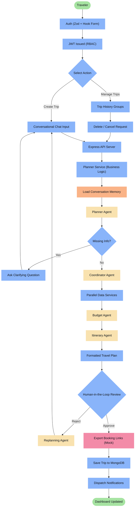
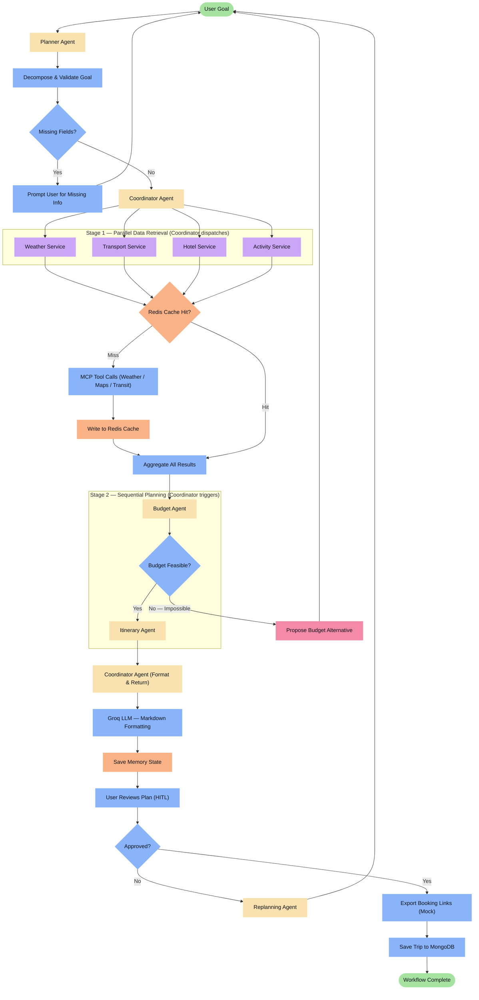
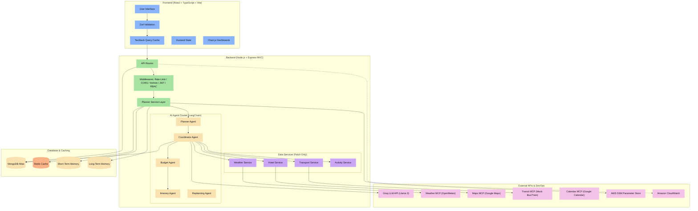
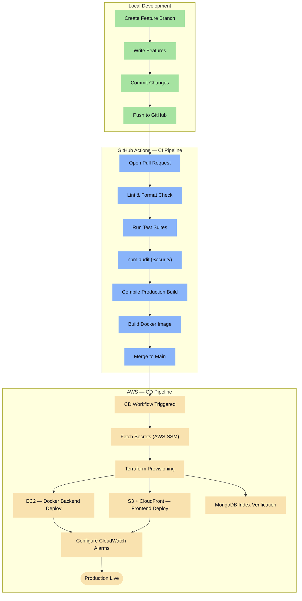
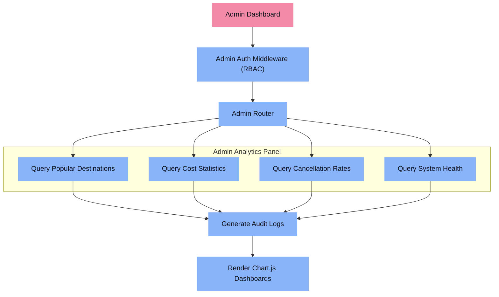

# Travel Planner AI Agent — Capstone Project Documentation


## Agent Design — Leaner Architecture

> [!IMPORTANT]
> This project uses **5 true AI agents** and **4 lightweight data services**. Not everything needs to be an agent — components that primarily fetch external data are implemented as services, keeping the AI layer lean and maintainable.

### AI Agents (LLM-Powered, Decision-Making)

| Agent | Responsibility |
|:------|:---------------|
| **Planner Agent** | Decomposes the user's natural-language goal, infers missing fields, and routes to the Coordinator |
| **Budget Agent** | Deterministically calculates cost breakdowns, flags impossible budgets, and proposes alternatives |
| **Itinerary Agent** | Generates structured day-by-day schedules from aggregated data |
| **Replanning Agent** | Re-runs planning from a modified goal when the user rejects a plan |
| **Coordinator Agent** | Orchestrates the full pipeline — delegates parallel tasks, aggregates results, triggers sequential agents, and formats the final itinerary |

### Data Services (No LLM — Fetch Only)

| Service | Responsibility |
|:--------|:---------------|
| **Weather Service** | Calls OpenMeteo API via Weather MCP; returns forecast data |
| **Transport Service** | Queries mock bus/train schedules via Transit MCP |
| **Hotel Service** | Queries mock hotel availability via Hotel MCP |
| **Activity Service** | Returns local attractions, dining, and events data |

> [!NOTE]
> Destination Recommendation logic is handled inside the **Planner Agent** using weather and budget context — it does not need its own agent at this scale.

---

## Coordinator Agent — Explicit Responsibilities

The Coordinator Agent is the central orchestrator of the AI pipeline. Its exact responsibilities are:

1. **Receive** — Accepts the structured goal object from the Planner Agent.
2. **Delegate (Parallel)** — Dispatches all four Data Services simultaneously for weather, transport, hotel, and activity data.
3. **Cache Check** — Checks Redis before each service call; skips the external MCP call on a cache hit.
4. **Aggregate** — Waits for all parallel results and merges them into a unified context object.
5. **Trigger (Sequential)** — Passes the merged context to Budget Agent → Itinerary Agent in strict order.
6. **Format** — Sends the completed itinerary to the Groq LLM for final markdown formatting.
7. **Return** — Delivers the formatted travel plan to the user for human-in-the-loop review.

---

## Booking — Honest Workflow

> [!WARNING]
> The "Booking Agent" in this project is **explicitly a mock**. It does **not** perform any real reservations, charge any payment method, or integrate with a live booking platform.

### What it actually does

```
Planner Agent
     ↓
Generate Travel Plan
     ↓
Human-in-the-Loop Review (Approve / Reject)
     ↓ (Approve)
Export Booking Links (Deep-links to real platforms)
     ↓
Save Trip to MongoDB (Status: Confirmed)
```

The mock booking layer:
- Generates **external deep-links** to Booking.com, MakeMyTrip, IRCTC, etc.
- Saves the confirmed trip record to MongoDB with status `"Confirmed"`.
- Does **not** create reservations or process payments.
- Simulates a confirmation receipt for demonstration purposes only.

---

## 1. User Flow

Traces the traveler's journey from authentication through itinerary approval and trip save.



---

## 2. Agent Flow

Shows the internal AI pipeline: how agents hand off work, how the Coordinator manages parallel and sequential stages, and how Redis caching reduces redundant API calls.



---

## 3. System Architecture

Maps all tier boundaries: Frontend, Backend Service Layer, AI Agent Cluster, Data Services, MCP Integrations, and Storage.



---

## 4. Deployment Pipeline

Illustrates the Git → CI → CD pipeline, from local development branch through GitHub Actions to AWS infrastructure provisioning.



---

## 5. Admin Workflow

Admin users bypass the AI layer entirely. They query MongoDB directly for analytics and system health dashboards.



---

## 6. Functional Execution Scenarios (Simulated Outputs)

### A. Itinerary Agent Output

The Itinerary Agent generates a structured day-by-day schedule. It factors in travel times, weather advisories, and daily spend caps set by the Budget Agent.

```markdown
# 5-Day Vacation in Ooty (Traveler Count: 2)
### Status: Draft | Month: October | Weather: Moderate Clear Skies

## Day 1 — Chennai to Ooty Arrival
* **08:00 AM – 11:30 AM | Rail Transit**
  * Train: Chennai Central → Mettupalayam | Estimated Cost: ₹1,200 (2 Sleeper Tickets)
* **11:30 AM – 12:00 PM | Hotel Check-in**
  * Hotel: Ooty Vista Inn | Transfer: 20-min cab from Mettupalayam station
* **12:00 PM – 01:30 PM | Lunch**
  * Restaurant: Garden View Cafe | Hours: 11:00 AM–10:00 PM | Cost: ₹600
* **03:00 PM – 05:30 PM | Afternoon Sightseeing**
  * Destination: Government Botanical Garden | Hours: 07:00 AM–06:30 PM | Entry: ₹100
  * Weather Note: Clear Skies — open-air activity recommended
* **05:30 PM – 07:30 PM | Evening Activity**
  * Destination: Ooty Tea Factory & Museum | Hours: 09:00 AM–07:00 PM | Ticket: ₹50
* **08:00 PM – 09:30 PM | Dinner**
  * Restaurant: Mountain Retreat Dining | Cost: ₹800
* **Day 1 Total**: ₹2,750 (excludes hotel pre-payment)
```

---

### B. Budget Agent Expense Report

The Budget Agent deterministically audits all cost estimates from services and applies a 10% emergency buffer.

| Expense Category | Item Details | Estimated Cost |
|:---|:---|:---:|
| **Transport** | Rail fares — Chennai to Ooty (return) | ₹1,800 |
| **Hotel** | 4 Nights — Ooty Vista Inn | ₹8,500 |
| **Food / Dining** | Meals, breakfast packages, local dining | ₹4,000 |
| **Activities** | Entry tickets, botanical gardens, tea estate | ₹3,500 |
| **Local Transport** | Station cabs, local auto transfers | ₹2,500 |
| **Emergency Fund** | 10% Reserve Buffer | ₹2,030 |
| **Grand Total** | All categories including emergency fund | **₹22,330** |
| **Remaining Budget** | Against base limit of ₹30,000 | **₹7,670** |

---

## 7. Tech Stack

| Layer | Technology | Purpose | Free Tier |
|:------|:-----------|:--------|:----------|
| **Frontend** | React (TypeScript) | Single Page Application UI | ✅ Free |
| | Vite | Dev server & production bundler | ✅ Free |
| | Tailwind CSS | Utility-first styling | ✅ Free |
| | React Hook Form + Zod | Auth form state & schema validation | ✅ Free |
| | TanStack Query | Query caching, pagination & HTTP state | ✅ Free |
| | Zustand | Client-side state store | ✅ Free |
| | Chart.js | Admin analytics dashboards | ✅ Free |
| | Axios | REST HTTP client | ✅ Free |
| **Backend** | Node.js + Express.js | REST API server (MVC pattern) | ✅ Free |
| | Mongoose | MongoDB ODM & schema enforcement | ✅ Free |
| | JWT | Authentication & RBAC roles | ✅ Free |
| | bcrypt | Password hashing | ✅ Free |
| | express-rate-limit | API rate throttling | ✅ Free |
| | Helmet | Express security headers | ✅ Free |
| | Morgan / Winston | Request tracing & diagnostics | ✅ Free |
| **AI / Agents** | Groq LLM API | LLM inference (Llama 3) | ✅ Free Developer Tier |
| | LangChain JS | Agent orchestration framework | ✅ Free |
| | Model Context Protocol (MCP) | Standardised tool-calling interface | ✅ Free |
| **Data & Cache** | MongoDB Atlas | Primary database (M0 shared cluster) | ✅ Free (M0 Cluster) |
| | Redis | In-memory API caching (weather, schedules) | ✅ Free (Self-hosted on EC2) |
| **DevOps** | GitHub Actions | CI/CD pipeline automation | ✅ 2,000 min/month free |
| | Docker | Container packaging | ✅ Free (Community) |
| | Terraform | Infrastructure as Code (VPC / EC2 / S3) | ✅ Free CLI |
| | AWS EC2 | Backend server host | ✅ 12-Month Free Tier |
| | AWS S3 + CloudFront | Static frontend host & CDN | ✅ 12-Month Free Tier |
| | AWS SSM Parameter Store | Secrets & config management | ✅ Always Free |
| | Amazon CloudWatch | Monitoring, alarms & logs | ✅ Standard Free Tier |
| **External APIs** | OpenMeteo API | Weather forecast data | ✅ Free (Non-Commercial) |
| | Google Maps API | Geocoding & location mapping | ✅ $200 monthly credit |
| | Google Calendar API | Event & reminder sync | ✅ Free Developer API |
| | Mock MCP Tools | Bus, Train, Hotel (mock only) | ✅ Free Mock Interfaces |

---

> **Note on Scope:** This is an internship capstone project. The AI pipeline demonstrates multi-agent orchestration patterns using free-tier infrastructure. The booking flow, transport schedules, and hotel data are intentionally mocked to focus on architecture and agent coordination rather than production integrations.
