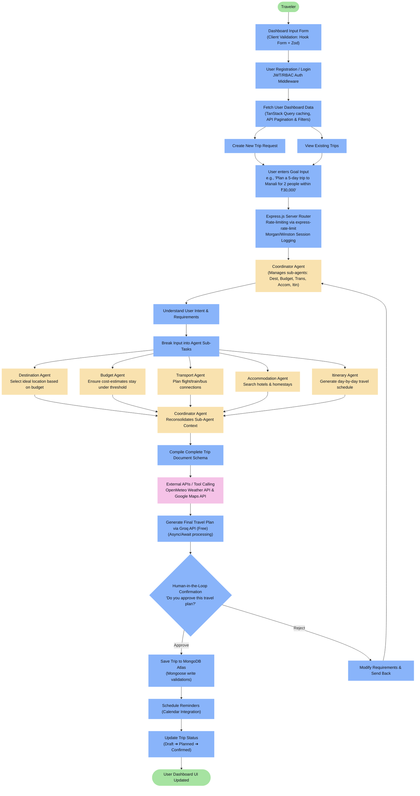
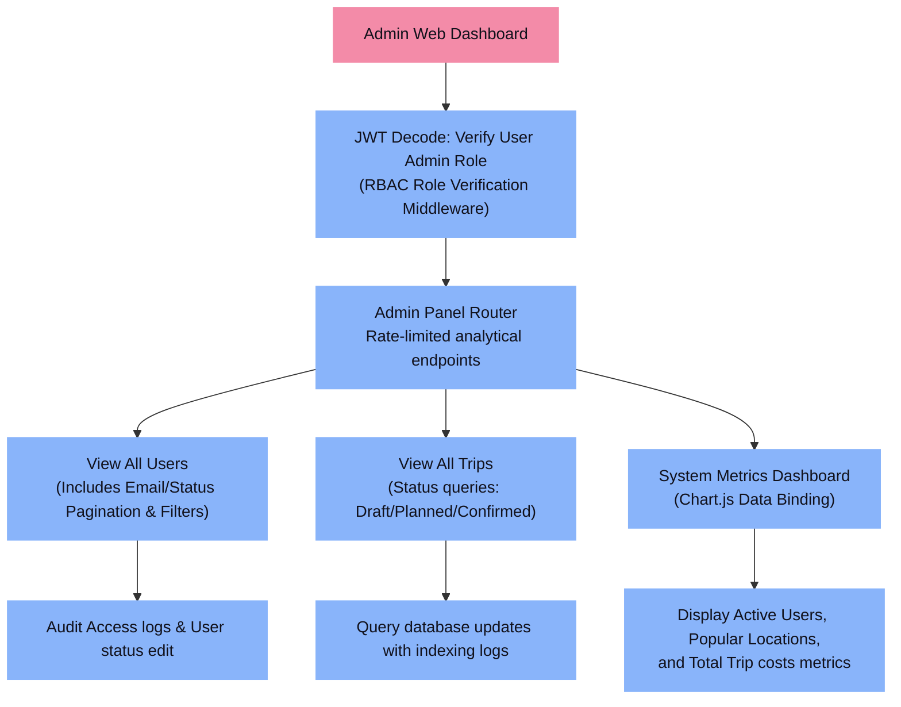
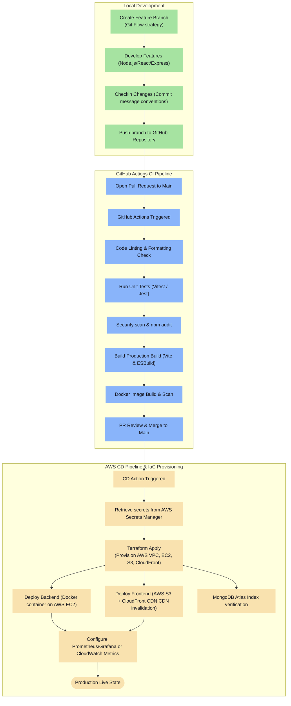
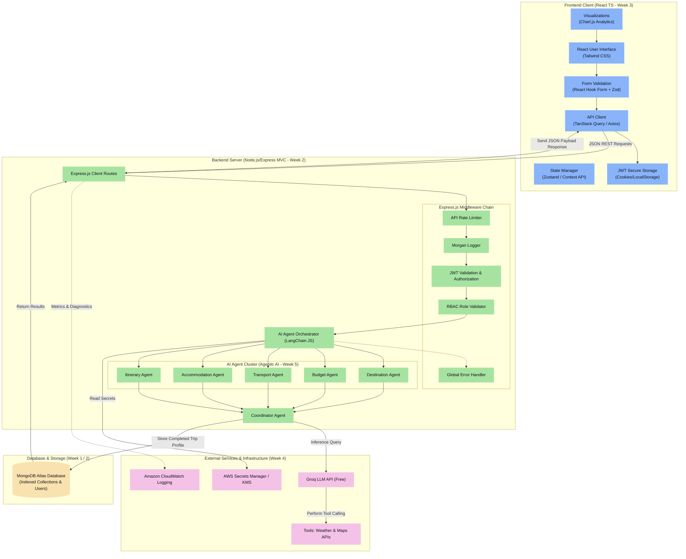

# Travel Planner AI Agent - Capstone Project Documentation

This repository contains the architecture, workflow designs, and system integration details for the Travel Planner AI Client/Server application. The project serves as a comprehensive capstone integrating the architectural principles and technologies studied from **Week 1 through Week 5**.

---

## 🗺️ Curriculum Integration (Week 1–5 Reference)

The architecture is built upon the following learning objectives:
* **Week 1 (Foundations & DSA)**: Schema design optimization, indexing configurations on database layers, and Git branching rules for robust repository management.
* **Week 2 (Backend Engineering)**: Node.js Express application utilizing the **MVC (Model-View-Controller) Design Pattern**, global error handling middleware, request rate-limiting, logging (Morgan/Winston), and async/await processing patterns.
* **Week 3 (Frontend & UX)**: Single Page Application (SPA) designed with React, TypeScript, state management (Zustand/Context), form state handling via **React Hook Form + Zod Schema Validation**, and optimized HTTP fetches/caching using **TanStack Query**.
* **Week 4 (DevOps & Infrastructure)**: Automated build checks using GitHub Actions, containerization using Docker, secrets protection using Cloud Key Management, and Infrastructure as Code (IaC) provisioning using **Terraform on AWS (EC2, S3, CloudFront, and Security Groups)**.
* **Week 5 (Agentic AI)**: Multi-Agent design featuring specialized decision blocks (Destination, Budget, Transport, Accommodation, and Itinerary agents) orchestrated by a centralized **Coordinator Agent** running on the free **Groq LLM API**.

---

## 1. Traveler Workflow

Traces the execution path starting from client-side Zod form validation, user auth authorization, Express router middleware, agent orchestration, external API tool calling, and human-in-the-loop validation, down to MongoDB persistence.

---

## 2. Admin Workflow

Details admin authorization, role validation middleware, navigation to administrative management sections, and metrics visualization dashboards.

---

## 3. AI Agent Internal Flow

Highlights conditional routing inside the backend agent orchestration layers for determining which services/tools need execution to complete a user request.

```mermaid
graph TD
    classDef default fill:#1e1e2e,stroke:#cdd6f4,stroke-width:2px,color:#cdd6f4;
    classDef startEnd fill:#a6e3a1,stroke:#a6e3a1,stroke-width:2px,color:#11111b;
    classDef process fill:#89b4fa,stroke:#89b4fa,stroke-width:2px,color:#11111b;
    classDef agent fill:#f9e2af,stroke:#f9e2af,stroke-width:2px,color:#11111b;
    classDef tool fill:#f5c2e7,stroke:#f5c2e7,stroke-width:2px,color:#11111b;

    Goal([User Goal]):::startEnd --> Planner["Coordinator Agent"]:::agent
    Planner --> Create["Initialize Agent Memory & Execution Sequence"]:::process
    
    %% Destination Step
    Create --> CheckDest{"Need Destination?"}:::process
    CheckDest -->|Yes| DestAgent["Destination Agent"]:::agent
    CheckDest -->|No| CheckBudget{"Need Budget?"}:::process
    DestAgent --> CheckBudget
    
    %% Budget Step
    CheckBudget -->|Yes| BudgetAgent["Budget Agent"]:::agent
    CheckBudget -->|No| CheckTransport{"Need Transport?"}:::process
    BudgetAgent --> CheckTransport
    
    %% Transport Step
    CheckTransport -->|Yes| TransportAgent["Transport Agent"]:::agent
    CheckTransport -->|No| CheckAccom{"Need Accommodation?"}:::process
    TransportAgent --> CheckAccom
    
    %% Accommodation Step
    CheckAccom -->|Yes| AccomAgent["Accommodation Agent"]:::agent
    CheckAccom -->|No| CheckItinerary{"Need Itinerary?"}:::process
    AccomAgent --> CheckItinerary
    
    %% Itinerary Step
    CheckItinerary -->|Yes| ItineraryAgent["Itinerary Agent"]:::agent
    CheckItinerary -->|No| CheckWeather{"Need Weather?"}:::process
    ItineraryAgent --> CheckWeather
    
    %% Weather Step
    CheckWeather -->|Yes| WeatherTool["Weather Tool<br/>(API Call)"]:::tool
    CheckWeather -->|No| CheckCalendar{"Need Calendar?"}:::process
    WeatherTool --> CheckCalendar
    
    %% Calendar Step
    CheckCalendar -->|Yes| CalendarTool["Calendar Tool<br/>(API Call)"]:::tool
    CheckCalendar -->|No| Coordinator["Coordinator Agent"]:::agent
    CalendarTool --> Coordinator
    
    %% Wrap-up
    Coordinator --> GenPlan["Generate Final Plan via Groq API (Free)"]:::process
    GenPlan --> AppReq{"Human Approval?"}:::process
    AppReq -->|Approved| Save["Save Trip Draft to DB"]:::process
    AppReq -->|Rejected| Planner
    Save --> End(["End"]):::startEnd
```

---

## 4. Project Development Workflow

Illustrates the Git workflow, Continuous Integration pipeline via GitHub Actions, Docker builds, Terraform IaC provisioning, and deployment endpoints on AWS.

---

## 5. Complete System Architecture

Maps out the structural tier boundaries: Frontend Web Client, Express.js Router context, AI Agent orchestration cluster, External Integrations, and persistent database layers.

