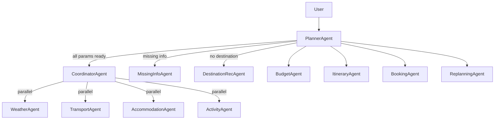

# 🤖 Agent Swarm — API, Fallback & Mock Data Reference

> **12 Agents · 8 MCP Servers · Complete Data Flow**

---

## 🗺️ How the Swarm Works



---

## 1. 🧠 Planner Agent (`plannerAgent.ts`)

> **Role:** Swarm Supervisor — orchestrates the entire trip planning pipeline.

| Category | Detail |
|----------|---------|
| **LLM** | `createChatModel` via Groq (multi-key rotation, temp: 0.1) |
| **Real APIs** | `getRestaurantsNearHotel` → **Geoapify Places API** (post-hotel selection enrichment) |
| **Orchestrates** | MissingInfo → DestinationRec → Parallel Agents → Budget → Itinerary → Synthesize |
| **Fallback** | If restaurant fetch near hotel fails → continues with destination-level defaults |
| **Mock Data** | ❌ None |

---

## 2. 🌦️ Weather Agent (`weatherAgent.ts` + `weatherMCP.ts`)

> **Role:** Fetch weather forecast for the destination dates.

### Cascade Priority (Tier 1 → 4)

| Priority | Source | API / Method | Key Required? |
|----------|--------|--------------|---------------|
| **1st** | OpenWeatherMap Forecast | `api.openweathermap.org/data/2.5/forecast` | ✅ `OPENWEATHER_API_KEY` |
| **2nd** | OpenMeteo Forecast (Free) | `api.open-meteo.com/v1/forecast` | ❌ No key needed |
| **3rd** | OpenMeteo Archive (Historical) | `archive-api.open-meteo.com/v1/archive` | ❌ No key needed |
| **4th** | **Static Mock Fallback** | Hardcoded seasonal placeholder | ❌ |

### Static Mock Data (Tier 4)
```json
{ "condition": "Partly Cloudy", "temp_high_c": 28, "temp_low_c": 22, "rain_mm": 0 }
```

| Category | Detail |
|----------|--------|
| **LLM Reasoning** | Groq LLM analyzes weather data for travel advice |
| **Fallback Text** | `"Weather parameters are favorable for local activities."` |

---

## 3. 🚆 Transport Agent (`transportAgent.ts` + `transitMCP.ts`)

> **Role:** Find flights, trains, and buses between origin and destination.

### Data Sources Per Mode

| Mode | Primary Source | API | Fallback |
|------|---------------|-----|---------|
| **Private Transfer** | Hotelbeds Transfers API | `HOTELBEDS_API_KEY` + `HOTELBEDS_ACTIVITIES_PATH` | Skipped if unconfigured |
| **Distance/Time** | Geoapify Routing API | `GEOAPIFY_API_KEY` | Hardcoded: `distanceKm=300, durationMin=360` |
| **✈️ Flight** | AviationStack Live Schedules | `AVIATIONSTACK_API_KEY` | Distance-based price estimate |
| **🚂 Train 3AC** | Computed from Geoapify distance | — | Distance heuristic formula |
| **🚂 Train 2AC** | Computed from Geoapify distance | — | Distance heuristic formula |
| **🚌 Bus Volvo** | Computed from Geoapify distance | — | Distance heuristic formula |
| **🚌 Bus KSRTC** | Computed from Geoapify distance | — | Distance heuristic formula |

### Flight Fallback Mock
When AviationStack fails, a computed estimate is added:
```
operator: "MAA -> BLR Estimated Flight"
data_source: "estimated_fallback"
```

### Pricing Formulas (Distance-based)
| Mode | Formula |
|------|---------|
| Flight | `₹2,500–₹10,000` (banded by distance) |
| Train 3AC | `₹150 + km × 1.4` per person |
| Train 2AC | `₹250 + km × 2.0` per person |
| Volvo Bus | `₹80 + km × 2.5` per person |
| KSRTC Bus | `₹50 + km × 1.6` per person |

| Category | Detail |
|----------|--------|
| **LLM Reasoning** | Groq LLM explains best transport option |
| **Fallback Text** | `"Transit options are scheduled and recommended based on speed and cost."` |
| **Selected Option** | Cheapest option auto-selected as default |

---

## 4. 🏨 Accommodation Agent (`accommodationAgent.ts` + `bookingMCP.ts`)

> **Role:** Search and categorize hotels by price tier.

### Data Source Cascade

| Priority | Source | API | Fallback |
|----------|--------|-----|---------|
| **1st** | Hotelbeds Content API | `HOTELBEDS_API_KEY` + `HOTELBEDS_API_SECRET` | → Next |
| **2nd** | Geoapify Places (`accommodation.hotel`) | `GEOAPIFY_API_KEY` | → Next |
| **3rd** | LLM-generated hotel recommendations | Groq LLM | → Empty `[]` |
| **4th** | `generateAccommodationFallback()` in agent | Groq LLM | Empty array |

### Price Tiers (Default)
| Tier | Price Range |
|------|-------------|
| **Budget** | `< ₹5,000/night` |
| **Mid-Range** | `₹5,000 – ₹15,000/night` |
| **Luxury** | `> ₹15,000/night` |

### Mock Data Flags
- `is_llm_recommended: true` — marks LLM-generated hotels
- `source_type: 'geoapify_places'` — marks Geoapify hotels
- Hotelbeds `rating` and `price_per_night_inr` are **computed** from star category codes (not real API prices)

### Hotelbeds Price Computation (Mock-like)
```
5★ → ₹18,000–₹32,000
4★ → ₹7,000–₹13,000
3★ → ₹3,000–₹5,500
2★ → ₹1,200–₹3,000
1★ → ₹700–₹1,500
```

| Category | Detail |
|----------|--------|
| **LLM Reasoning** | Groq analyzes and justifies hotel choices |
| **Max 3 per tier** | `budget[0:3]`, `mid_range[0:3]`, `luxury[0:3]` |
| **Fallback Text** | `"Lodgings are chosen near primary destination routes."` |

---

## 5. 🎭 Activity Agent (`activityAgent.ts` + `mapsMCP.ts` + `hotelbedsActivitiesMCP.ts`)

> **Role:** Find attractions, restaurants, and sightseeing near destination.

### Data Source Cascade

| Priority | Source | API | Condition |
|----------|--------|-----|-----------|
| **1st** | Hotelbeds Activities API | `HOTELBEDS_API_KEY` + Activities endpoint | `isHotelbedsConfigured('activities')` |
| **2nd** | Geoapify Places (Tourist + Restaurants) | `GEOAPIFY_API_KEY` | Always attempted |
| **3rd** | `generateRecommendationFallback()` | Groq LLM | If `attraction_options.length === 0` |

### Mock Data in Geoapify Results
Geoapify doesn't return real ratings, so they are **randomly generated**:
```typescript
rating: parseFloat((3.8 + Math.random() * 1.1).toFixed(1))  // 3.8 – 4.9
price_level: Math.round(1 + Math.random() * 2)              // 1–3
user_ratings_total: Math.round(50 + Math.random() * 950)    // 50–1000
```

### LLM Fallback Mock Flags
```
source_type: 'llm_recommendation'
place_id: 'llm-rec-attraction-0'
is_llm_recommended: true
```

| Category | Detail |
|----------|--------|
| **Unsplash Photo** | Hotelbeds attractions use generic Unsplash URL as `photo_reference` |
| **Description Enrichment** | LLM adds descriptions to attractions missing them |
| **LLM Reasoning** | Groq justifies activity selections |
| **Fallback Text** | `"Local sight-seeing options align with generic adventure preferences."` |

---

## 6. 💰 Budget Agent (`budgetAgent.ts`)

> **Role:** Pure computation — aggregates costs from all agents and checks feasibility.

| Category | Detail |
|----------|--------|
| **Real APIs** | ❌ None — purely mathematical |
| **Input Sources** | Transport option, Hotel price, Restaurant `price_level` |
| **Emergency Fund** | **+10%** of subtotal |
| **Local Transport Buffer** | Suggested budget includes **+30%** buffer for enrichment step |
| **Mock/Fallback** | Fixed per-person food rates when no restaurant data: `₹425–₹500/person/day` |

### Food Cost Heuristics (Fallback)
| Condition | Cost Per Person/Day |
|-----------|---------------------|
| Restaurant `price_level` data available | `₹325 + (avg_level × ₹210)` |
| Restaurants list exists (no price_level) | `₹425` |
| No restaurant data at all | `₹500` |

---

## 7. 📅 Itinerary Agent (`itineraryAgent.ts`)

> **Role:** Generate day-by-day JSON schedule using real attraction data.

| Category | Detail |
|----------|--------|
| **Real APIs** | ❌ None — uses data already fetched by Activity/Weather/Transport agents |
| **LLM** | Groq (temp: 0.3, maxTokens: 4096) |
| **Batching** | Max **5 days per LLM call** to prevent truncation |
| **Attempts** | 2 retries per batch |

### Fallback Schedule (when LLM fails both attempts)
```
09:00 – Visit/Recommended <attraction>
13:00 – Lunch at local restaurant
15:00 – Explore/Recommended <attraction>
19:00 – Dinner & evening leisure
daily_total_inr: ₹1,800 (hardcoded)
weather_note: "Check local conditions before heading out."
```

---

## 8. 📍 Maps MCP (`mapsMCP.ts`)

> **Role:** Geocoding, routing, places lookup — all powered by Geoapify.

| Function | Primary API | Fallback |
|----------|------------|---------|
| `getCoordinates()` | Geoapify Geocoding | LLM estimates lat/lon |
| `getPlacesNearby()` | Geoapify Places (15km radius) | Returns empty → Activity Agent triggers LLM |
| `getDistanceMatrix()` | Geoapify Routing API | LLM estimates distance/time |
| `getRestaurantsNearHotel()` | Geoapify Places (2km radius) | LLM recommends restaurants |
| `getHotelsNearby()` | Geoapify Places (`accommodation.hotel`) | LLM recommends hotels |
| `getTransitDirections()` | Geoapify Routing API | LLM estimates route steps |

### Ultimate Static Backup (if LLM also fails routing)
```typescript
distance_km: 12.0
duration_min: 25
steps: ["Commute from <origin> to <destination> via local auto/cab."]
```

### LLM Geocoding Fallback (if LLM fails)
```typescript
{ lat: 20.5937, lon: 78.9629 }  // Geographic center of India
```

---

## 9. 🗓️ Booking Agent (`bookingAgent.ts` + `calendarMCP.ts`)

> **Role:** Finalize trip — create Google Calendar event and generate booking references.

| Category | Detail |
|----------|--------|
| **Real API** | **Google Calendar API** (`googleapis` SDK, `GOOGLE_CALENDAR_CLIENT_ID` + `GOOGLE_CALENDAR_CLIENT_SECRET`) |
| **Auth** | OAuth2 — reads `googleRefreshToken` + `googleAccessToken` from MongoDB User record |
| **Fallback** | Gracefully skipped if user hasn't linked Google account |

### Mock Booking References (always generated)
> ⚠️ **These references are NOT real bookings.** They are simulated confirmation codes.

```
Hotel Ref:     HB-HTL-<HOTEL_PREFIX>-<6-digit random>
Transport Ref: PNR-<MODE>-<OPERATOR>-<6-digit random>
Calendar:      Real Google Calendar event ID (if connected)
```

---

## 10. 🎯 Missing Info Agent (`missingInfoAgent.ts`)

| Category | Detail |
|----------|--------|
| **Real APIs** | ❌ None |
| **LLM** | Groq — checks which trip parameters are missing |
| **Output** | `complete: boolean` + `clarifyingQuestion: string` |

---

## 11. 🌐 Destination Rec Agent (`destinationRecAgent.ts`)

| Category | Detail |
|----------|--------|
| **Real APIs** | ❌ None |
| **LLM** | Groq — recommends top destinations based on interests, budget, season |
| **Output** | List of 3-5 destinations + top pick |

---

## 12. 🔄 Replanning Agent (`replanningAgent.ts`)

| Category | Detail |
|----------|--------|
| **Real APIs** | ❌ None |
| **LLM** | Groq — modifies existing trip plan based on user change requests |
| **Re-runs** | Calls `runPlannerAgent` if full regeneration is needed |

---

## 🔑 Environment Variables Summary

| Variable | Used By | Required? |
|----------|---------|-----------|
| `GROQ_API_KEY_1..5` | All agents (LLM via `createChatModel`) | ✅ At least 1 |
| `GEOAPIFY_API_KEY` | mapsMCP (Geocode, Places, Routing) | ⚠️ Recommended |
| `OPENWEATHER_API_KEY` | weatherMCP (5-day forecast) | ⚠️ Optional |
| `AVIATIONSTACK_API_KEY` | transitMCP (live flights) | ⚠️ Optional |
| `HOTELBEDS_API_KEY` | bookingMCP, hotelbedsActivitiesMCP, hotelbedsTransfersMCP | ⚠️ Optional |
| `HOTELBEDS_API_SECRET` | bookingMCP | ⚠️ Optional |
| `HOTELBEDS_BASE_URL` | bookingMCP (sandbox vs prod) | ⚠️ Optional |
| `GOOGLE_CALENDAR_CLIENT_ID` | calendarMCP | ⚠️ Optional |
| `GOOGLE_CALENDAR_CLIENT_SECRET` | calendarMCP | ⚠️ Optional |

---

## ⚠️ What Is Real vs. Mock/Estimated

| Data Point | Real or Mock? |
|-----------|--------------|
| Weather forecast | ✅ Real (OpenMeteo / OpenWeatherMap) |
| Flight schedules (operator/times) | ✅ Real (AviationStack) |
| Flight **prices** | ⚠️ Estimated (distance-based formula) |
| Train/Bus prices | ⚠️ Estimated (distance-based formula) |
| Distances/Travel time | ✅ Real (Geoapify Routing) |
| Hotel names (Hotelbeds) | ✅ Real |
| Hotel **prices** (Hotelbeds) | ⚠️ Estimated (star-category formula) |
| Hotel names (Geoapify) | ✅ Real |
| Hotel **prices** (Geoapify) | ⚠️ Random within star-tier range |
| Restaurant names | ✅ Real (Geoapify) or LLM-generated |
| Restaurant ratings | ⚠️ Randomly generated (Geoapify has no ratings) |
| Attraction names | ✅ Real (Geoapify/Hotelbeds) or LLM-generated |
| Booking reference codes | ❌ Mock — simulated (not real reservations) |
| Google Calendar event | ✅ Real (if Google account linked) |
